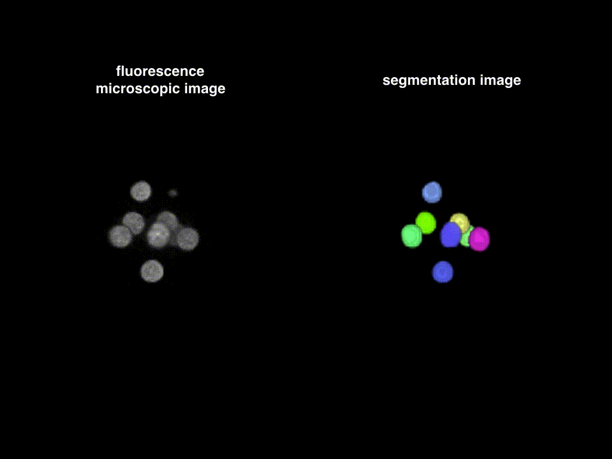
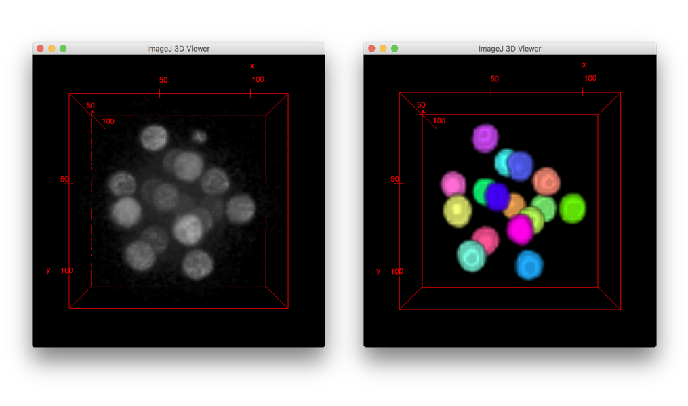

# QCANet: Quantitative Criteria Acquisition Network [PyTorch version]

This is the code for [3D convolutional neural networks-based segmentation to acquire quantitative criteria of the nucleus during mouse embryogenesis](https://doi.org/10.1038/s41540-020-00152-8).
This project is carried out in cooperation with [Funahashi Lab. at Keio University](https://fun.bio.keio.ac.jp/) and three labs: Hiroi Lab. at Sanyo-onoda City University, [Kobayashi Lab. at the University of Tokyo](http://research.crmind.net/), and Yamagata Lab. at Kindai University.


## News

* [2022/11/02] A paper on NVAN (Normalized Multi-View Attention Network), an algorithm for predicting the live birth potential of mouse embryos using QCANet, has been published. For more information, please click [here](https://doi.org/10.1016/j.artmed.2022.102432).


## Overview

Quantitative Criteria Acquisition Network (QCANet) performs instance segmentation of 3D fluorescence microscopic images.
QCANet consists of Nuclear Segmentation Network (NSN) that learned nuclear segmentation task and Nuclear Detection Network (NDN) that learned nuclear identification task.
QCANet performs instance segmentation of the time-series 3D fluorescence microscopic images at each time point, and the quantitative criteria for mouse development are extracted from the acquired time-series segmentation image.
The detailed information on this code is described in our paper published on [npj Systems Biology and Applications](https://doi.org/10.1038/s41540-020-00152-8).

## Performance

The result of instance segmentation of time-series 3D fluorescence microscopic images using QCANet is shown below.
The left hand side of the image(movie) is the early-stage mouse embryo, whose cell nuclei were fluorescently labeled with mRFP1 fused to histone 2B, which is a chromatin marker. The right hand side of the image(movie) is the segmentation image obtained by QCANet.




## Requirements

- [Python 3.7](https://www.python.org/downloads/)
- [PyTorch 1.7.0](https://pytorch.org/)
- [Matplotlib 3.4.2](https://matplotlib.org/)
- [NumPy 1.19.2](http://www.numpy.org)
- [scikit-image 0.17.2](http://scikit-image.org/)

See requirements.txt for details.


## QuickStart

1. Download the QCANet repository by `git clone`.
2. ~~Download learned model.~~ (PyTorch version of QCANet does not currently available trained models.)
3. Change directory to `QCANet/src`.
4. Run QCANet. (This can be done after creating a trained model in "How to train and run QCANet with your data" below.)
    - On Linux:

        ```sh
        % git clone https://github.com/funalab/QCANet.git
        % cd QCANet
        % python src/tools/qca_net.py --scaling_seg --scaling_det [--gpu gpu]
        ```

    - On macOS:

        ```sh
        % git clone https://github.com/funalab/QCANet.git
        % cd QCANet
        % python src/tools/qca_net.py --scaling_seg --scaling_det [--gpu gpu]
        ```


    The processing time of above example will be about 20 sec on GPU (NVIDIA Tesla K40).
    In this script, the input images are hard coded to be `images/example_input/16cell-image.tif`, and
    the expected output of this segmentation is stored in `images/example_output/ws_16cell-stage.tif`.
    You can visualize both input and output images with 3D viewer plugin [[1]](#ref1) of Fiji (screenshot is shown below).

    

4. Extract quantitative criteria from the segmentation images.

    ```sh
    % python src/tools/extract.py
    ```

    Extracted quantitative criteria from the segmentation image will be exported to `criteria.csv`.

## How to train and run QCANet with your data

1. At first, prepare the dataset following the directory structure as follows:

    ```
    your_dataset/
           +-- images_raw/  (3D fluorescence microscopic image)
           |           +-- image1.tif
           |           +-- image2.tif
           |           +-- image3.tif
           +-- images_nsn/  (the ground truth of segmentation)
           |           +-- image1.tif
           |           +-- image2.tif
           |           +-- image3.tif
           +-- images_ndn/  (the ground truth of detection)
           |           +-- image1.tif
           |           +-- image2.tif
           |           +-- image3.tif
    ```
    Note: The pair of image and ground truth must be the same name.


2. Train NSN & NDN with the above-prepared dataset.

    Train NSN:
    ```sh
    % python src/tools/train.py --conf_file confs/example_train_nsn.cfg
    ```

    Train NDN:
    ```sh
    % python src/tools/train.py --conf_file confs/example_train_ndn.cfg
    ```

    Prepare the config file describing detailed parameters for training.

    ```
    [Dataset]
    root_path                                   : Specify root directory path for training data.
    split_list_train                            : Specify the path of the file in which the image file name used for training is enumerated
    split_list_validation                       : Specify the path of the file in which the image file name used for validation is enumerated
    input_format                                : Specify the file format of the dataset (tif, png, jpg, npz)
    resolution                                  : Specify microscope resolution of x-, y-, and z-axis. (defalt=1.0:1.0:2.18)

    [Model]
    model                                       : Specify model name {"NSN", "NDN"}
    ndim                                        : Specify dimensions of input / convolution kernel
    lossfun                                     : Specify loss function
    init_model                                  : Initialize the segmentor from given file
    ch_in                                       : Specify number of channels for input (image)
    ch_base                                     : Specify number of base channels (to control total memory and segmentor performance)
    ch_out                                      : Specify number of channels for output (label)

    [Runtime]
    save_dir                                    : Specify output files directory where segmentation images and model file will be stored.
    batchsize                                   : Specify minibatch size.
    epoch                                       : Specify the number of sweeps over the dataset to train.
    optimizer                                   : Specify optimizer (Adam or SGD).
    init_lr                                     : Specify initial learning rate ("alpha" in case of Adam)
    weight_decay                                : Specify weight decay for optimizer scheduling
    gpu                                         : Specify GPU ID (negative value indicates CPU).
    patch_size                                  : Specify one side voxel size of ROI.
    normalization                               : Will use mean normalization method.
    augmentation                                : Will do data augmentation (flip & random crop).
    class_weight                                : Will use Softmax_Corss_Entropy.
    scaling                                     : WIll do image-wise scaling.
    ```

3. Run QCANet with the above-prepared dataset.

    Prepare a directory which stores images that were not used for learning(ex. `validation/`) and
    perform segmentation and detection with `qca_net.py` to the images in this directory.
    We recommend to add the same options to `qca_net.py` you specified at learning (`train.py`).
    Also, please specify a learned model (It is named as `*.npz` generated by the above learning process).
    The accepted options will be displayed by `-h` option.

    ```
    % python src/tools/qca_net.py -i validation/ -ms learned_nsn_path -md learned_ndn_path [optional arguments]
    ```


4. Extract quantitative criteria of time-series data.

    Pass the directory path that stores the segmentation images outputted by process 3 (`WatershedSegmentationImages/`) to the argument `-i`.

    ```sh
    % python src/tools/extract.py -i path_of_segmentation_images
    ```
    Extracted quantitative criteria will be exported to `criteria.csv`.


# Acknowledgement

The microscopic images included in this repository is provided by Yamagata Lab., Kindai University.
The development of this algorithm was funded by JSPS KAKENHI Grant Numbers 16H04731 and 20H03244 to [Akira Funahashi](https://github.com/funasoul).

# References

<a name="ref1"></a> [[1] Schmid, Benjamin, et al. "A high-level 3D visualization API for Java and ImageJ." BMC bioinformatics 11.1 274 (2010).](https://bmcbioinformatics.biomedcentral.com/articles/10.1186/1471-2105-11-274)